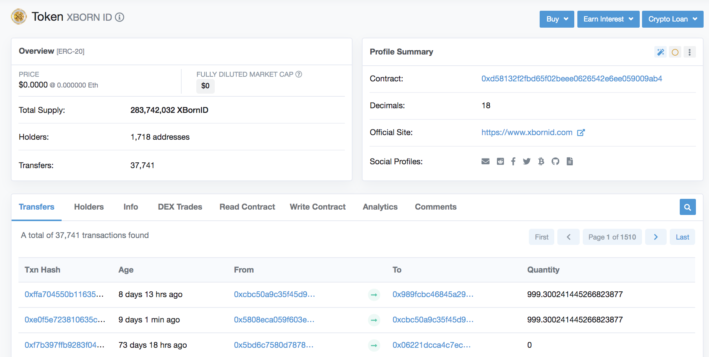
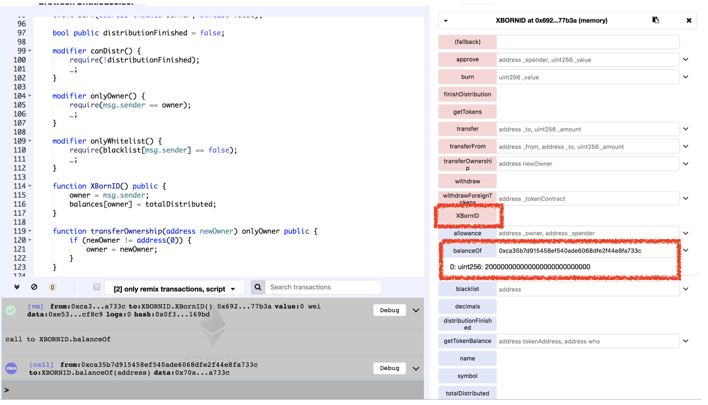

# Vulnerability
CVE-XXX-XXX

## Vendor
AIRDROPX BORN

## Vulnerability Type
Typo in Constructor

## Abstract
We found a vulnerability in smart contract of "XBORNID" which is an Ethereum ERC20 Token. Because there is a typo in constructor, the attacker can change the owner of the contract and able to obtain XBORNID token for free.

## Details
'XBORNID' is a Ethereum ERC20 Token contract. The total number of transactions submit to this contract is 41,813, and 1,718 users holds this token.
Moreover, the last transaction date of this contract is 8 days ago which is actively used by external users.


  *Figure 1. XBORNID Token Information*

In the constructor of the 'XBORNID' contract, there is logic of changing owner of the contract to function caller.
Moreover, 'the XBORNID' Tokens are assigned to owner. 

```
contract XBORNID is ERC20 {
...
function XBornID() public {
   owner = msg.sender;
   balances[owner] = totalDistributed;
    }
}
```
  The problem is that the constructor of the 'XBORNID' Token become normal `public` function which can be called by external attackers.
By calling this function, attacker can become owner of the contract and could obtain 'XBORNID' Tokens for free.
  
```
modifier onlyOwner() {
        require(msg.sender == owner);
        _;
    }

function withdraw() onlyOwner public {
        uint256 etherBalance = address(this).balance;
        owner.transfer(etherBalance);
    }
```
Also, once the attacker becomes the owner of the contract, it can bypass `onlyOwner` modifier and calls `withdraw` function to steal all the ether holds by the contract.

## Exploit

  Below figure is the result of `XBornID` function. We can obtain Tokens for free and able to become owner of the contract easily.

  
  *Figure 2. The Result of XBornID() function*

## Conclusion
The constructor name must be same as contract name or `constructor` keyword should be used for defining constructor.

## Reference
https://etherscan.io/token/0xd58132f2fbd65f02beee0626542e6ee059009ab4

https://xbornid.com/

## Discoverer
Anonymous
