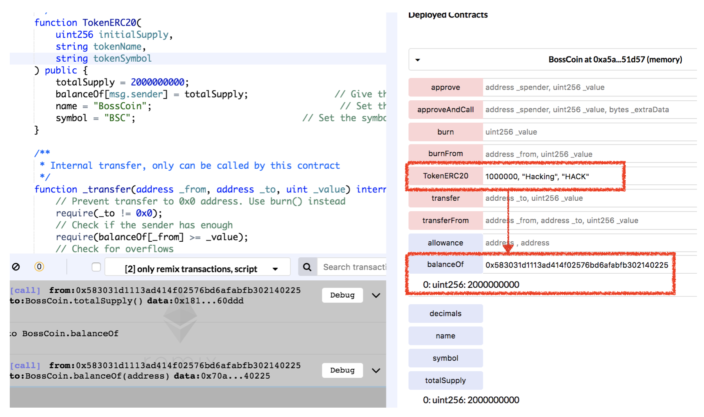

# Vulnerability
CVE-2019-18775

## Vendor
BossCoin Token

## Vulnerability Type
Vulnerable Constructor

## Abstract
We found a vulnerability in the smart contract of "BossCoin" token. 
Because it copies and pastes the standard example code of "TokenERC20" contract and only changes the name of the contract not the name of the constructor, the constructor of "TokenERC20" becomes general public function which can be accessed by external attackers.
The attackers can obtain BossCoin tokens for free by just calling it.

## Details
BossCoin is an Ethereum ERC20 Token contract. The total number of transfers submitted to this contract is 4,295, and 2,181 users holding this token.
Moreover, the last transfer date of this contract is 10 days ago which indicates that it is actively used by external users.


  *Figure 1. BossCoin Token Information*

The problem is that the developer of "BossCoin" contract copied and pasted the standard example code of "TokenERC20" contract and only changes the name of the contract not the name of the constructor.

```
contract BossCoin {
   
   /**
     * Constructor function
   **/
   function TokenERC20(
        uint256 initialSupply,
        string tokenName,
        string tokenSymbol
   ) public {
      totalSupply = 2000000000;
      balanceOf[msg.sender] = totalSupply;                // Give the creator all initial tokens
      name = "BossCoin";                                   // Set the name for display purposes
      symbol = "BSC";                               // Set the symbol for display purposes
  }
  ...
}
```
As shown in the above code from the BossCoin contract, the name of the contract is BossCoin.
However, the BossCoin contract consists of constructor of TokenERC20 contract.
Because the name of the constructor of TokenERC20 and the name of the contract is different,
the constructor of TokenERC20 accidentally becomes a general `public` function.
As a result, external attackers can call such function and obtain BossCoin tokens without paying necessary fee.
More specifically, the attacker can obtain 2000000000 BossCoin tokens for free by just calling the constructor of TokenERC20 contract which is a `public` function in BossCoin contract.

## Exploit
The below figure shows the result of calling the constructor of `TokenERC20` function.
As we can see that after calling `TokenERC20` function, we successfully obtained 2000000000 BossCoin tokens.

  
  *Figure 2. The Result of calling TokenERC20 function*

## Conclusion
The constructor name must be same as contract name or `constructor` keyword should be used for defining constructor.

## Reference
https://etherscan.io/token/0x687c7ceb80211d1c0ec3636c3332cb5fa256ac2b
https://github.com/ethereum/ethereum-org/blob/master/solidity/token-erc20.sol

## Discoverer
Anonymous
