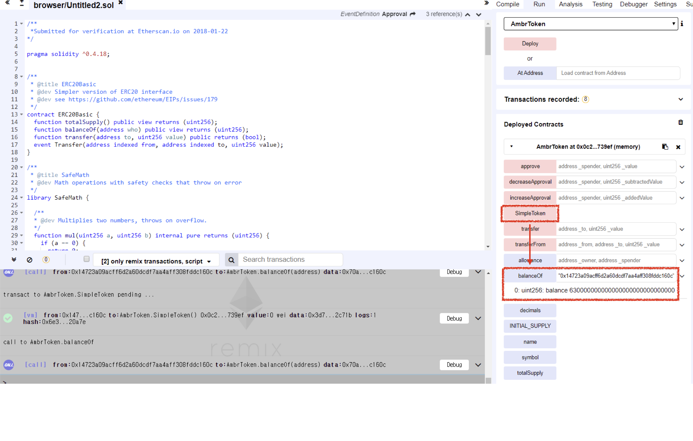

# Vulnerability
CVE-XXX

## Vendor
AmbrToken Token

## Vulnerability Type
Vulnerable Constructor

## Abstract
We found a vulnerability in the smart contract of "AmbrToken" token. Because it copies and pastes the standard example code of "SimpleToken" contract and only changes the name of the contract not the name of the constructor, the constructor of "SimpleToken" becomes general public function which can be accessed by external attackers. The attackers can obtain AmbrToken tokens for free by just calling it.

## Details
AmbrToken is a Ethereum ERC20 Token contract. The total number of transactions submitted to this contract is 6,027, and 3,689 users are holding the AmbrToken token.
Moreover, the last transaction date of this contract is 6 days ago which indicates that the contract is actively being used by external users.


  *Figure 1. AmbrToken Token Information*

The problem is that the developer of "AmbrToken" contract copied and pasted the standard example code of "SimpleToken" contract and only changes the name of the contract not the name of the constructor.

```
contract AmbrToken is StandardToken {
...
function SimpleToken() public {
    totalSupply_ = INITIAL_SUPPLY;
    balances[msg.sender] = INITIAL_SUPPLY;
    Transfer(0x0, msg.sender, INITIAL_SUPPLY);
    }
}
```
As shown in the above code from the AmbrToken contract, the name of the contract is AmbrToken.
However, the AmbrToken contract consists of constructor of SimpleToken contract.
Because the name of the constructor of SimpleToken and the name of the contract is different,
the constructor of SimpleToken accidentally becomes a general `public` function.
As a result, external attackers can call such function and obtain AmbrToken tokens without paying necessary fee.
More specifically, the attacker can obtain AmbrToken for free by just calling the constructor of SimpleToken contract which is a `public` function in AmbrToken contract.

## Exploit
  Below figure is the result of `SimpleToken` function. 
  As we can see that after calling `SimpleToken` function, we can obtain Tokens for free easily.

  
  *Figure 2. The Result of SimpleToken function*

## Conclusion
The constructor name must be same as contract name or `constructor` keyword should be used by developers.

## Reference
https://etherscan.io/token/0xfd7cb51943844c80bd68d0070c03cf8a20da6fdb
https://github.com/OpenZeppelin/openzeppelin-contracts/blob/ad12381549c4c0711c2f3310e9fb1f65d51c299c/contracts/examples/SimpleToken.sol

## Discoverer
Sungjae Hwang (sjhwang87@kaist.ac.kr) and Sukyoung Rry (sryu.cs@kaist.ac.kr)