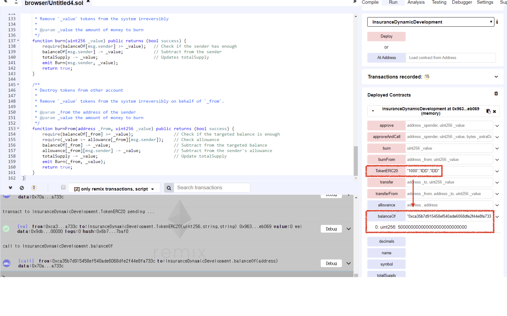

# Vulnerability
CVE-XXX

## Vendor
InsuranceDynamicDevelopment Token

## Vulnerability Type
Vulnerable Constructor

## Abstract
We found a vulnerability in the smart contract of "InsuranceDynamicDevelopment" token. Because it copies and pastes the standard example code of "TokenERC20" contract and only changes the name of the contract not the name of the constructor, the constructor of "TokenERC20" becomes general public function which can be accessed by external attackers. The attackers can obtain InsuranceDynamicDevelopment tokens for free by just calling it.

## Details
InsuranceDynamicDevelopment is an Ethereum ERC20 Token contract. The total number of transfers submitted to this contract is 1,164, and 135 users holding this token.
Moreover, the last transfer date of this contract is 10 days ago which indicates that it is actively used by external users.


  *Figure 1. InsuranceDynamicDevelopment Token Information*

The problem is that the developer of "InsuranceDynamicDevelopment" contract copied and pasted the standard example code of "TokenERC20" contract and only changes the name of the contract not the name of the constructor.

```
contract InsuranceDynamicDevelopment {
   ...
    /**
     * Constructor function
     *
     * Initializes contract with initial supply tokens to the creator of the contract
     */
   function TokenERC20(
        uint256 initialSupply,
        string tokenName,
        string tokenSymbol
   ) public {
      totalSupply = 500000000000000000000000000;    // Update total supply with the decimal amount
      balanceOf[msg.sender] = totalSupply;          // Give the creator all initial tokens
      name = "InsuranceDynamicDevelopment";         // Set the name for display purposes
      symbol = "IDD";                               // Set the symbol for display purposes
  }
  ...
}
```
As shown in the above code from the InsuranceDynamicDevelopment contract, the name of the contract is InsuranceDynamicDevelopment.
However, the InsuranceDynamicDevelopment contract consists of constructor of TokenERC20 contract.
Because the name of the constructor of TokenERC20 and the name of the contract is different,
the constructor of TokenERC20 accidentally becomes a general `public` function.
As a result, external attackers can call such function and obtain InsuranceDynamicDevelopment tokens without paying necessary fee.
More specifically, the attacker can obtain 500000000 InsuranceDynamicDevelopment tokens for free by just calling the constructor of TokenERC20 contract which is a `public` function in InsuranceDynamicDevelopment contract.

## Exploit
The below figure shows the result of calling the constructor of `TokenERC20` function.
As we can see that after calling `TokenERC20` function, we successfully obtained 500000000 InsuranceDynamicDevelopment tokens.

  
  *Figure 2. The Result of TokenERC20 function*

## Conclusion
The constructor name must be same as contract name or `constructor` keyword should be used for defining constructor.

## Reference
https://etherscan.io/token/0x042c83572d9b3ddac2c368018e296e5af0ceecdc
https://github.com/ethereum/ethereum-org/blob/master/solidity/token-erc20.sol

## Discoverer
Sungjae Hwang (sjhwang87@kaist.ac.kr) and Sukyoung Rry (sryu.cs@kaist.ac.kr)