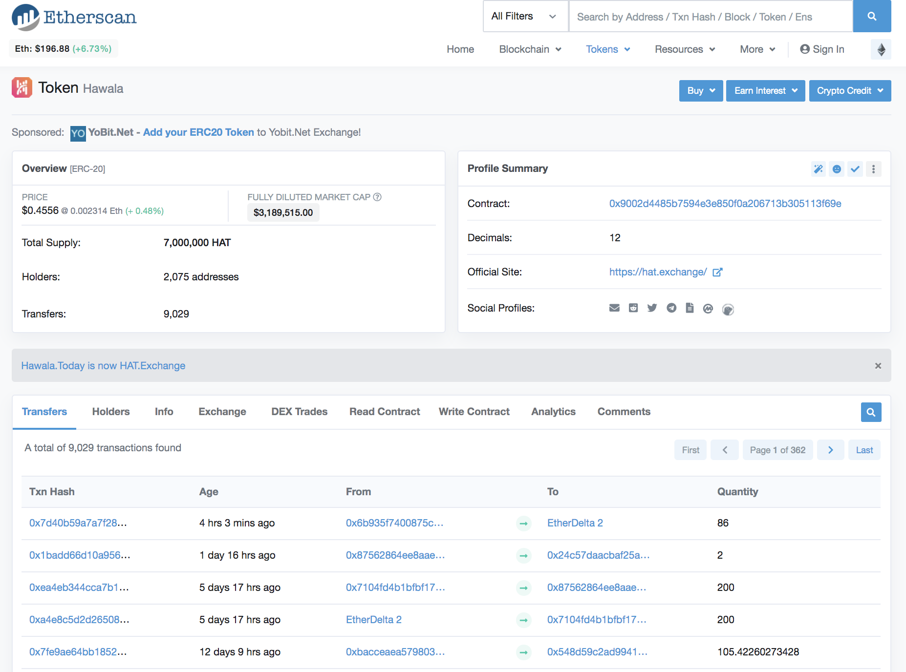
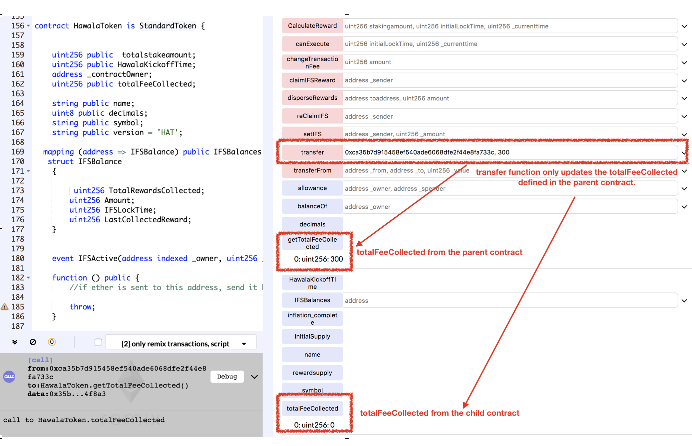

# Vulnerability
CVE-xxxx-xxxx

## Vendor
Hawala Token

## Vulnerability Type
Variable Shadowing Confusion : DoS

## Abstract
We found a vulnerability in the smart contract of "Hawala" token.
Because the storage `totalFeeCollected` is defined in both parent and child contracts, the functions in parent refer `totalFeeCollected` defined in the parent whereas functions in child refer `totalFeeCollected` defined in the child.
The problem is that the addition to `totalFeeCollected` variable is done only by the child contract and subtraction is done only by the parent contract.
As a result, the value of `totalFeeCollected` is inconsistent and leads to issues such as not able to transfer rewards to users.

## Details
"Hawala" is an Ethereum ERC20 Token contract. 
The total number of transfers submitted to this contract is 9,029, and 2,075 users holding this token.
Moreover, the last transfer date of this contract is 4 hrs 3 minutes ago which indicates that it is actively used by external users.


  *Figure 1. HKDT Information*

```
contract HawalaToken is StandardToken {
  uint256 public totalFeeCollected;

  function disperseRewards(address toaddress ,uint256 amount) public returns (bool success){
    if(msg.sender==_contractOwner)
    {
      if(inflation_complete)
      {
        if(totalFeeCollected>0 && totalFeeCollected>amount)
        {
          totalFeeCollected = safeSub(totalFeeCollected,amount);
          balances[toaddress] = safeAdd(balances[toaddress],amount);
          Transfer(msg.sender, toaddress, amount);
          return true;
        }
      }
    }
    ..
    return false;
  }
}

contract StandardToken is Token {
  uint256 public totalFeeCollected;

  function transfer(address _to, uint256 _value) public  returns (bool success) {
  if (balances[msg.sender] >= _value && _value > 0)
  {
    if(inflation_complete)
    {
      uint256 CalculatedFee = safeMul(safeDiv(transactionfeeAmount,100000000000000),transactionfeeAmount);
      balances[msg.sender] = safeSub(balances[msg.sender],_value);
      _value = safeSub(_value,CalculatedFee);
      totalFeeCollected = safeAdd(totalFeeCollected,CalculatedFee);
      balances[_to] = safeAdd(balances[_to],_value);
      Transfer(msg.sender, _to, _value);
      return true;
    }
  }
  ...
  }
}

```
`HawalaToken` inherited the `StandardToken` contract.
There are two different copies of `totalFeeCollected` variables, one in the `HawalaToken` contract and another one in `StandardToken` contract.
The problem is that the `transfer` function in `StandardToken` contract refers the `totalFeeCollected` defined in `StandardToken` contract, whereas the `disperseRewards` function in `HawalaToken` refers the `totalFeeCollected` defined in `HawalaToken` contract.

Because the addition to `totalFeeCollected` variable is done only by the `transfer` function in `StandardToken` contract and subtraction is done only by the `disperseRewards` function in `HawalaToken` contract, there is inconsistency in the value of `totalFeeCollected` variable as these two functions refer two different copies of the `totalFeeCollected` variables.
Hence, the value of `totalFeeCollected` variable is also 0 in the perspective of `HawalaToken` contract and therefore, the `disperseRewards` function always fails to distribute the rewards to users as it requires `totalFeeCollected` to be greater than 0.

## Exploit
As we can see from the below test, the `transfer` function defined in the parent contract only updates the `totalFeeCollected` variable defined in the parent.
As a result the `totalFeeCollected` variable from the child contract is always 0, and therefore, `disperseRewards` function fails to distribute rewards to users.

  
  *Figure 2. The Result of calling _totalSupply function*

## Conclusion
If there are same name of the storage variables in both parent and child contract, they are two separated versions of variables. 

## Reference
https://etherscan.io/address/0x9002d4485b7594e3e850f0a206713b305113f69e

## Discoverer
Sungjae Hwang (sjhwang87@kaist.ac.kr) and Sukyoung Rry (sryu.cs@kaist.ac.kr)
