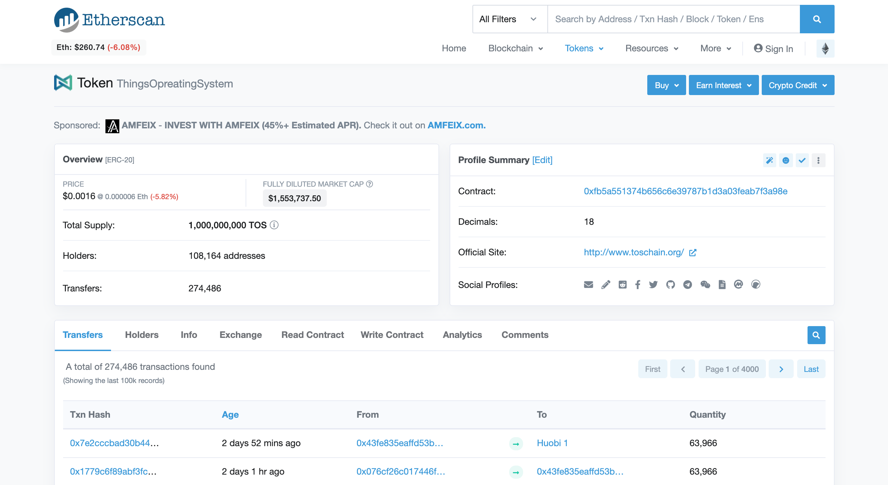
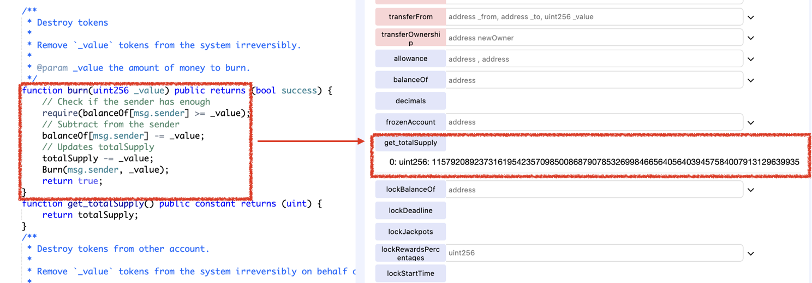

# Vulnerability
CVE-XXX

## Vendor
ThingsOperatingSystem Token (TOS)

## Vulnerability Type
Variable Shadowing Confusion & Integer Underflow

## Abstract
We found a vulnerability in the smart contract of "TOS" token.
Because the storage `totalSupply` is defined in both parent and child contracts, the functions in parent refer `totalSupply` defined in the parent whereas functions in child refer `totalSupply` defined in the child. The problem is that because only the `totalSupply` defined in the child is initialized, the integer underflow occurs if the `totalSupply` defined in the parent is referred.

## Details
"ThingsOperatingSystem" is an Ethereum ERC20 Token contract. 
The total number of transfers submitted to this contract is 274,488, and 108,163 users holding this token.
Moreover, the last transfer date of this contract is 1 day ago which indicates that it is actively used by external users.


  *Figure 1. ThingsOperatingSystem Information*

The problem is that the `totalSupply` storage variables are defined in both parent and child contracts.

```
contract TokenERC20 {
    uint256 public totalSupply;
  ..
    function burn(uint256 _value) public returns (bool success) {
        // Check if the sender has enough
        require(balanceOf[msg.sender] >= _value);
        // Subtract from the sender
        balanceOf[msg.sender] -= _value;
        // Updates totalSupply
        totalSupply -= _value;
        Burn(msg.sender, _value);
        return true;
    }
  ..
}

contract TosToken is owned, TokenERC20 {
    ..
    uint256 public totalSupply = 1000000000 * 10 ** uint256(decimals);
    ..
}

```
`TosToken` inherited the `TokenERC20` contract.
There are two difference copies of `totalSupply` variables, one in the `TokenERC20` contract and another one in `TosToken` contract.
The problem is that the `burn` function in `TokenERC20` contract refers the `totalSupply` defined in `TokenERC20`, but only the `totalSupply` defined in `TosToken` is initialized. Hence, integer underflow will occurs when the `burn` function decreases the `totalSupply` value.

## Exploit
The below figure shows the result of calling `burn` function in `TokenERC20` contract.
As we can see that the `totalSupply` variable is changed to an extremely big number due to integer underflow.
Note that the value of `totalSupply` before calling `burn` function was 0.

  
  *Figure 2. The Result of calling get_totalSupply function*

## Conclusion
If there are same name of the storage variables in both parent and child contract, they are two separated versions of variables. Initializing one does not initialize the other.

## Reference
https://etherscan.io/address/0xfb5a551374b656c6e39787b1d3a03feab7f3a98e

## Discoverer
Sungjae Hwang (sjhwang87@kaist.ac.kr) and Sukyoung Rry (sryu.cs@kaist.ac.kr)
