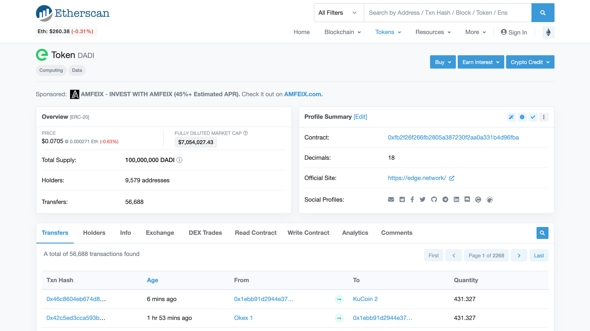
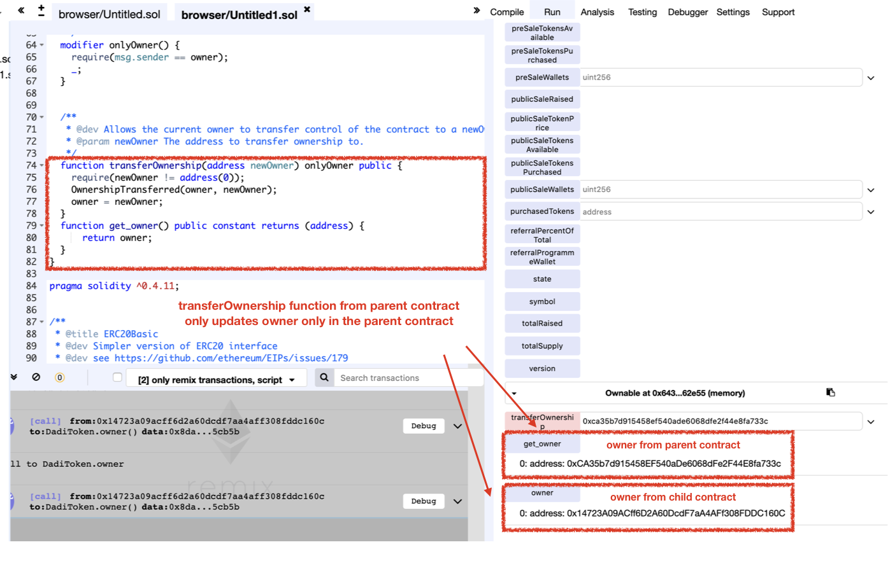

# Vulnerability
CVE-XXX

## Vendor
DADI Token

## Vulnerability Type
Variable Shadowing Confusion

## Abstract
We found a vulnerability in the smart contract of "DADI" token.
Because the storage variable `owner` is defined in both parent and child contracts, the functions in parent refer `owner` defined in the parent whereas functions in child refer `owner` defined in the child. The problem is that once the `transferOwnership` function in the parent gets called, it updates only the `owner` variable defined in the parent leaving `owner` defined in the child intact.

## Details
"DadiToken" is an Ethereum ERC20 Token contract. 
The total number of transfers submitted to this contract is 56,688, and 9,579 users holding this token.
Moreover, the last transfer date of this contract is 6 minutes ago which indicates that it is actively used by external users.


  *Figure 1. DADI Information*

The problem is that the `owner` storage variables are defined in both parent and child contracts.

```
contract Ownable {
  address public owner;
  ..
  function transferOwnership(address newOwner) onlyOwner public {
    require(newOwner != address(0));
    OwnershipTransferred(owner, newOwner);
    owner = newOwner;
  }
}

contract DadiToken is StandardToken, Ownable {
    ..
    address public owner;
    ..
}

```
`DadiToken` inherited the `Ownable` contract.
There are two difference copies of `owner` variables, one in the `Ownable` contract and another one in `DadiToken` contract.
The problem is that the `transferOwnership` function in `Ownable` contract updates the `owner` defined in `Ownable`, but `owner` defined in `DadiToken` is not changed.

## Exploit
The below figure shows the result of calling `transferOwnership` function in `Ownable` contract.
As we can see that the `transferOwnership` function defined in the parent cannot change `owner` defined in the child contract. Therefore, `transferOwnership` function fails to change owner.

  
  *Figure 2. The Result of calling transferOwnership function*

## Conclusion
If there are same name of the storage variables in both parent and child contract, they are two separated versions of variables.

## Reference
https://etherscan.io/address/0xfb2f26f266fb2805a387230f2aa0a331b4d96fba

## Discoverer
Sungjae Hwang (sjhwang87@kaist.ac.kr) and Sukyoung Rry (sryu.cs@kaist.ac.kr)
