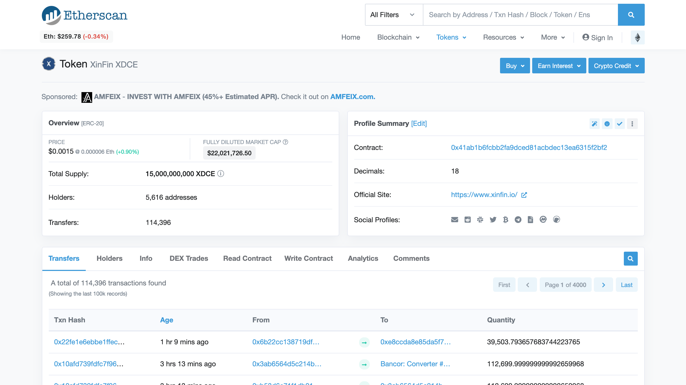
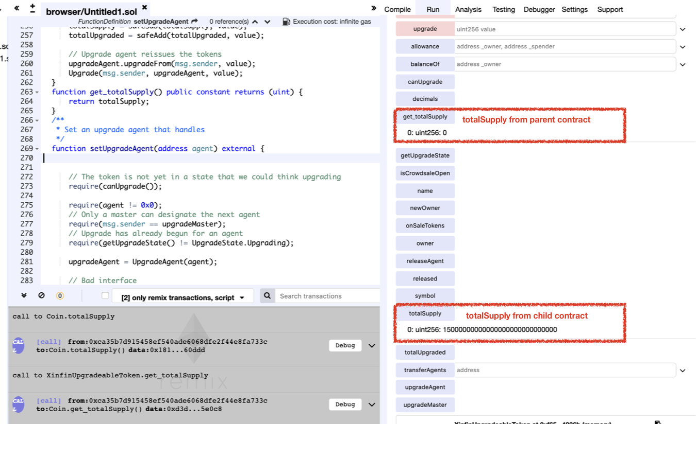

# Vulnerability
CVE-XXX

## Vendor
XinFin XDCE Token

## Vulnerability Type
Variable Shadowing Confusion

## Abstract
We found a vulnerability in the smart contract of "XinFin XDCE" token.
Because the storage `totalSupply` is defined in both parent and child contracts, the functions in parent refer `totalSupply` defined in the parent whereas functions in child refer `totalSupply` defined in the child. The problem is that because only the `totalSupply` defined in the child is initialized, and the `totalSupply` defined in the parent is not initialized.

## Details
"XinFin XDCE" is an Ethereum ERC20 Token contract. 
The total number of transfers submitted to this contract is 114,396, and 5,616 users holding this token.
Moreover, the last transfer date of this contract is 2 hours ago which indicates that it is actively used by external users.


  *Figure 1. XinFin XDCE Information*

The problem is that the `totalSupply` storage variables are defined in both parent and child contracts.

```
contract ERC20 {

  uint public totalSupply;
  ..
}

contract StandardToken is ERC20, SafeMathLib {
    ..
}

contract XinfinUpgradeableToken is StandardToken {
    ..
}

contract Coin is XinfinUpgradeableToken, ReleasableToken {
    ..
    uint public totalSupply = 15000000000 * (10 ** decimals);
    ..   
}

```
`Coin` contract inherited the `XinfinUpgradeableToken` contract, and `XinfinUpgradeableToken` contract inherited `StandardToken` contract, and `StandardToken` contract inherited `ERC20` contract.
There are two difference copies of `totalSupply` variables, one in the `ERC20` contract and another one in `Coin` contract.
The problem is that the `totalSupply` variable in `Coin` is initialized. However, `totalSupply` variable in `ERC20` is not initialized, so two `totalSupply` variables have different values.

## Exploit
The below figure shows the value of `totalSupply` variable in parent and child contract.
As we can see that the `totalSupply` variable in child contract is initialized but `totalSupply` variable in parent contract is not initialized.

  
  *Figure 2. difference in value of variable*

## Conclusion
If there are same name of the storage variables in both parent and child contract, they are two separated versions of variables. Initializing one does not initialize the other.

## Reference
https://etherscan.io/address/0x41ab1b6fcbb2fa9dced81acbdec13ea6315f2bf2

## Discoverer
Sungjae Hwang (sjhwang87@kaist.ac.kr) and Sukyoung Rry (sryu.cs@kaist.ac.kr)
