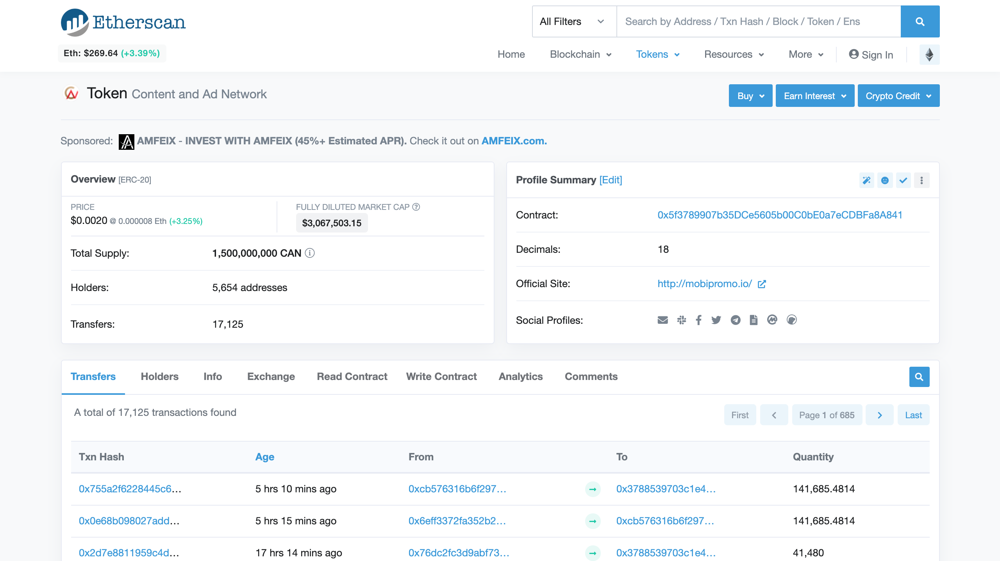
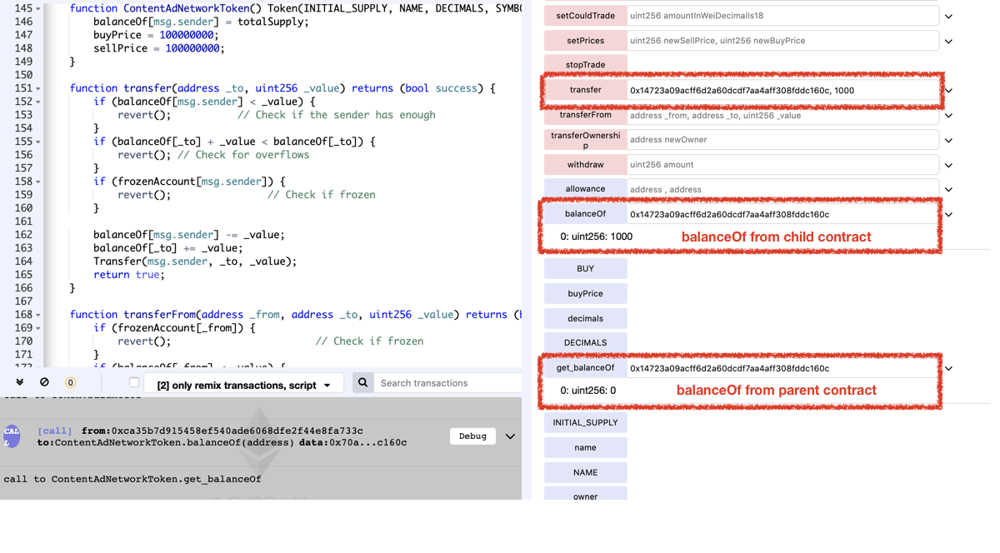

# Vulnerability
CVE-XXX

## Vendor
Content and Ad Network Token (CAN)

## Vulnerability Type
Variable Shadowing Confusion

## Abstract
We found a vulnerability in the smart contract of "Content and Ad Network"(CAN) token.
Because the mapping variable `balanceOf` is defined in both parent and child contracts, the function `transfer` in child refer `balanceOf` defined in the child and `balanceOf` defined in parent cannot be changed.

## Details
"Content and Ad Network" is an Ethereum ERC20 Token contract. 
The total number of transfers submitted to this contract is 17,125, and 5,654 users holding this token.
Moreover, the last transfer date of this contract is 5 hours and 10 mins ago which indicates that it is actively used by external users.


  *Figure 1. Content and Ad Network Token Information*

The problem is that the `balanceOf` storage variables are defined in both parent and child contracts.

```
contract Token {
    ..
    mapping (address => uint256) public balanceOf;
    ..
}

contract ContentAdNetworkToken is Token, Owner {
    ..
    mapping (address => uint256) public balanceOf;
    ..
    function transfer(address _to, uint256 _value) returns (bool success) {
        if (balanceOf[msg.sender] < _value) {
            revert();           // Check if the sender has enough
        }
        if (balanceOf[_to] + _value < balanceOf[_to]) {
            revert(); // Check for overflows
        }
        if (frozenAccount[msg.sender]) {
            revert();                // Check if frozen
        }

        balanceOf[msg.sender] -= _value;
        balanceOf[_to] += _value;
        Transfer(msg.sender, _to, _value);
        return true;
    }
}

```
`ContentAdNetworkToken` inherited the `Token` contract.
There are two difference copies of `balanceOf` variables, one in the `Token` contract and another one in `ContentAdNetworkToken` contract.
The problem is that the `transfer` function in `ContentAdNetworkToken` contract refers the `balanceOf` defined in `ContentAdNetworkToken`, therefore `balanceOf` defined in parent contract cannot be changed.

## Exploit
The below figure shows the result of calling `transfer` function in `ContentAdNetworkToken` contract.
As we can see that the `balanceOf` variable defined in child get updated, but `balanceOf` variable defined in parent is not changed.

  
  *Figure 2. The Result of calling transfer function*

## Conclusion
If there are same name of the storage variables in both parent and child contract, they are two separated versions of variables.

## Reference
https://etherscan.io/address/0x5f3789907b35DCe5605b00C0bE0a7eCDBFa8A841

## Discoverer
Sungjae Hwang (sjhwang87@kaist.ac.kr) and Sukyoung Rry (sryu.cs@kaist.ac.kr)
