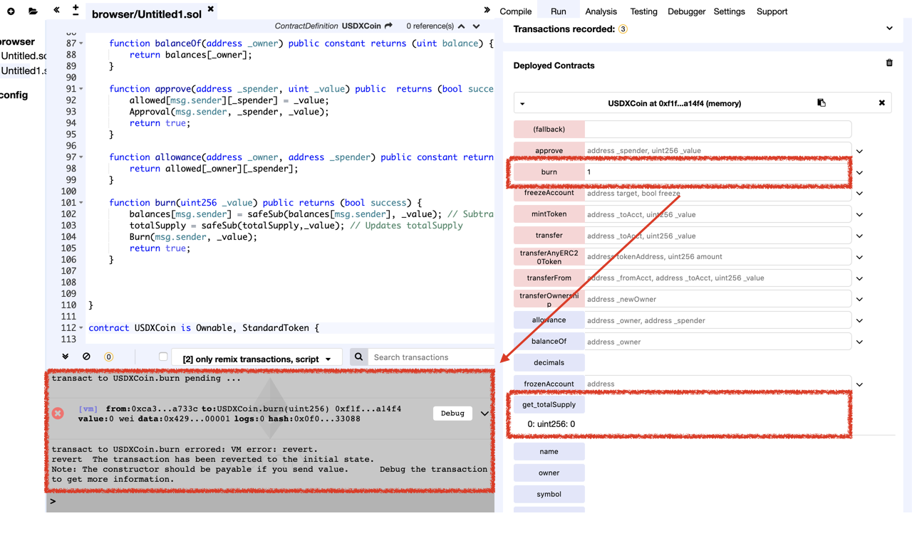

# Vulnerability
CVE-XXX

## Vendor
USDX Token

## Vulnerability Type
Variable Shadowing Confusion

## Abstract
We found a vulnerability in the smart contract of "USDX" token.
Because the storage `totalSupply` is defined in both parent and child contracts, the functions in parent refer `totalSupply` defined in the parent whereas functions in child refer `totalSupply` defined in the child. The problem is that because only the `totalSupply` defined in the child is initialized, and the `totalSupply` defined in the parent is not initialized.

## Details
"USDX" is an Ethereum ERC20 Token contract. 
The total number of transfers submitted to this contract is 23,125, and 154 users holding this token.


  *Figure 1. USDX Information*

The problem is that the `totalSupply` storage variables are defined in both parent and child contracts.

```
contract ERC20 {
    uint public totalSupply;
    ..
}

contract StandardToken is ERC20, SafeMath {
    ..
    function burn(uint256 _value) public returns (bool success) {
        balances[msg.sender] = safeSub(balances[msg.sender], _value); // Subtract from the sender
        totalSupply = safeSub(totalSupply,_value); // Updates totalSupply
        Burn(msg.sender, _value);
        return true;
    }
}

contract USDXCoin is Ownable, StandardToken {
    ..
    uint public totalSupply;
    ..
    function USDXCoin() public {
    totalSupply = 10 * (10**6) * (10**6);
        balances[msg.sender] = totalSupply;
        name = "USDX";
        symbol = "USDX";
        decimals = 6;
    }
    ..
}
```
`USDXCoin` contract inherited the `StandardToken` contract, and `StandardToken` contract inherited `ERC20` contract.
There are two difference copies of `totalSupply` variables, one in the `ERC20` contract and another one in `USDXCoin` contract.
The problem is that the `totalSupply` variable in `USDXCoin` is initialized. However, `totalSupply` variable in `ERC20` is not initialized, so two `totalSupply` variables have different values. `burn` function defined in `StandardToken` refers the `totalSupply` defined in `ERC20`, so `burn` function cannot burn the token.

## Exploit
The below figure shows the result of calling `burn` function in `TokenERC20` contract.
As we can see that the `totalSupply` variable in `ERC20` is 0.
So, `burn` function cannot be executed.

  
  *Figure 2. The Result of calling burn function*

## Conclusion
If there are same name of the storage variables in both parent and child contract, they are two separated versions of variables. Initializing one does not initialize the other.

## Reference
https://etherscan.io/address/0xe38165c9f6deb144afc9c32c206b024817e1496d

## Discoverer
Sungjae Hwang (sjhwang87@kaist.ac.kr) and Sukyoung Rry (sryu.cs@kaist.ac.kr)
