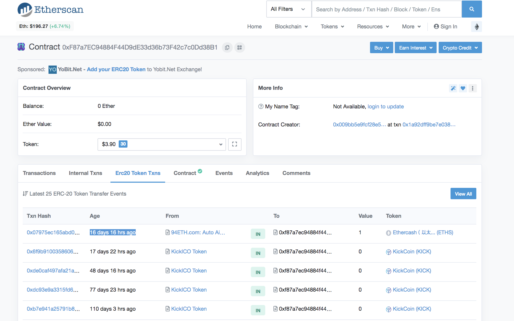
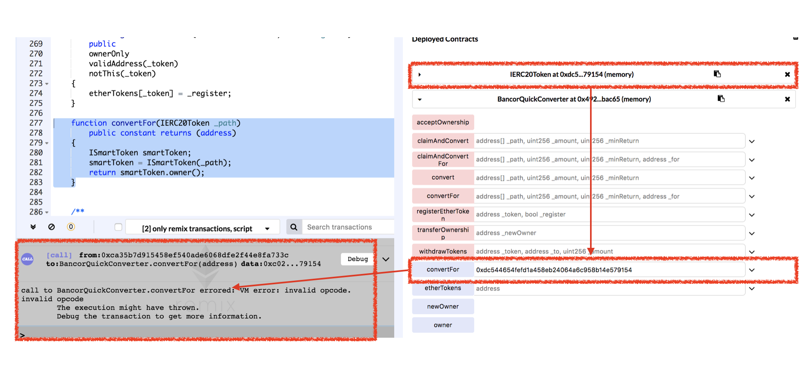
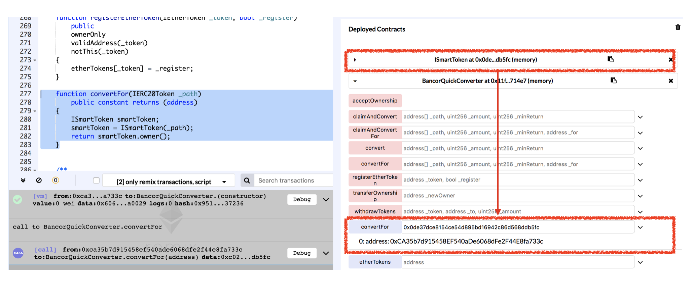

# Vulnerability
CVE-xxxx-xxxxx

## Vendor
BancorQuickConverter (Ethereum Smart Contract)

## Vulnerability Type
Down-Casting

## Abstract
We found a down-casting vulnerability in the smart contract of "BancorQuickConverter" which leads to calling non-existing function.

## Details
'BancorQuickConverter' is an Ethereum smart contract. 
The total number of external and internal transactions submitted to this contract is 122,448 and the last transaction date of this contract is 16 days 16 hours ago which indicates that the contract is actively used by external users.


  *Figure 1. BancorQuickConverter Information*

```
contract BancorQuickConverter is IBancorQuickConverter, TokenHolder {
	
  function convertFor(IERC20Token[] _path ..) public .. returns (uint256)
  {
    ..
    ISmartToken smartToken;
    for (uint256 i = 1; i < pathLength; i += 2) {
      smartToken = ISmartToken(_path[i]);
      toToken = _path[i + 1];
      converter = ITokenConverter(smartToken.owner());
    }
    ..
  }
}

contract ISmartToken is IOwned, IERC20Token {...}

```
As we can see from the above code, the `IERC20Token` type is converted to the `ISmartToken` type, and assign the conversion result into the `smartToken` variable.
However, as shown in the last line of the code, the `ISmartToken` contract is a child contract of the `IERC20Token` contract.
This means the result of down-casting is stored into the `smartToken` variable and it is used to call `owner()` function.
The problem is that the `owner()` function only exists in the `ISmartToken` contract and not in the `IERC20Token`.
As the `smartToken` variable holds an object of `IERC20Token` type and therefore calling `owner()` function leads to unexpected behaviors.

## Exploit
We test the minimized version of `convertFor` function for simplicity.
The minimized version of `convertFor` is shown below.

```
function convertFor(IERC20Token path) public constant returns (address)
{
  ISmartToken smartToken;
  smartToken = ISmartToken(path);
  return smartToken.owner();
}
```
We first generated the `IERC20Token` contract and passed it to the `convertFor` function as a parameter.
As we can see from the below figure, the `convertFor` function call failed as the `IERC20Token` contract does not have `owner()` function. 

  
  *Figure 2. The Result of convertFor function with IERC20Token*

This time, we generated the `ISmartToken` contract and passed it to the `convertFor` function.
As we can see from the below figure, the `converFor` function call succeeds and returns the address of the owner.

  
  *Figure 3. The Result of convertFor function with ISmartToken*

As shown in the above experiments, depending on the type of passed parameter to the `converFor` function, the result is different.
The problem is that the `converFor` function asks external users to pass the `IERC20Token` type of contract and this will result in unexpected behaviors as it is used to call `owner()` function which does not exist in its type. Because the `IERC20Token` is down-casted (ISmartToken) before calling `owner()` function, the Solidity compiler does not throw error as the `owner()` function exist in `ISmartToken` type.

## Conclusion
Down-casting is unsafe and causes issues such as calling non-existing functions.
It is not recommeded to convert a parent contract into one of its derived contracts.

## Reference
https://etherscan.io/address/0xf87a7ec94884f44d9de33d36b73f42c7c0dd38b1#tokentxns

## Discoverer
Anonymous
