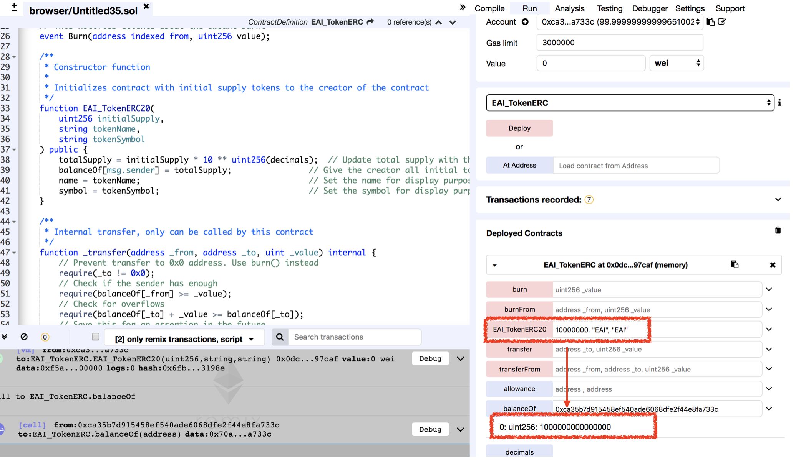

# Vulnerability
CVE-XXX-XXX

## Vendor
EAI Token

## Vulnerability Type
Typo in Constructor

## Abstract
We found a vulnerability in smart contract of "EAI" token. Because there is a typo in constructor, the attacker can obtain EAI tokens for free.

## Details
'EAI' is a Ethereum ERC20 Token contract. The total number of transactions submit to this contract is 17,928, and 941 users holding this token.
Moreover, the last transaction date of this contract is 3 days ago which is actively used by external users.


  *Figure 1. EAI Token Information*

In the constructor of the 'EAI' contract, all the initial tokens are assigned to constructor caller. 

The problem is that the constructor of the EAI token becomes normal `public` function which can be called by external attackers due to the typo in constructor.

By just calling the typo constructor, attacker can obtain tokens for free. 
Note that attacker can control the parameters of the constructor and therefore, he can obtain as many tokens as he wants.

```
contract EAI_TokenERC {
...
function EAI_TokenERC20(
        uint256 initialSupply,
        string tokenName,
        string tokenSymbol
    ) public {
        totalSupply = initialSupply * 10 ** uint256(decimals);  // Update total supply with the decimal amount
        balanceOf[msg.sender] = totalSupply;                // Give the creator all initial tokens
        name = tokenName;                                   // Set the name for display purposes
        symbol = tokenSymbol;                               // Set the symbol for display purposes
    }
```

## Exploit

  Below figure is the result of `EAI_TokenERC20` function. We can obtain Tokens for free easily.
  For this example, we passed the value '10000000' so that we got '10000000' EAI tokens. 
  We can adjust this value to change the token amount which we want to obtain.

  
  *Figure 2. The Result of EAI_TokenERC20() function*

## Conclusion
The constructor name must be same as contract name or `constructor` keyword should be used for defining constructor.

## Reference
https://etherscan.io/token/0x9ef0eb9d97e4e7c8612d4e5aaf9201e35bd3670b


## Discoverer
Anonymous
