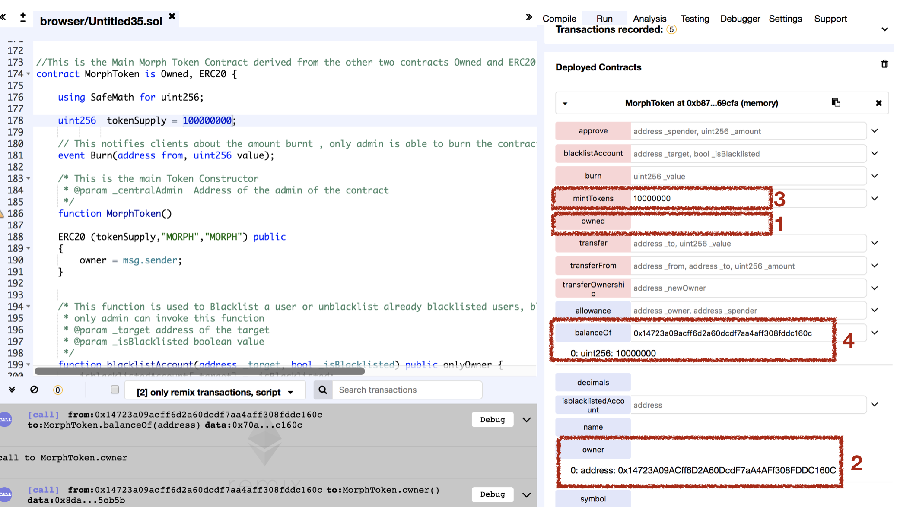

# Vulnerability
CVE-XXX-XXX

## Vendor
MORPH Token

## Vulnerability Type
Typo in Constructor

## Abstract
We found a vulnerability in smart contract of "MORPH" token. Because there is a typo in constructor of Owned contract which is inherited by MORPH token, allows attackers to acquire contract ownership.
A new owner can subsequently obtain MORPH token for free and can perform DoS attack.

## Details
'MORPH' is an Ethereum ERC20 Token contract. The total number of transactions submit to this contract is 18,275, and 4,148 users holding this token.
Moreover, the last transaction date of this contract is 3 days ago which is actively used by external users.


  *Figure 1. MORPH Token Information*

The constructor of the 'Owned' contract changes the owner of the contract. 
The problem is that the constructor of the Owned contract becomes normal `public` function which can be called by external attackers due to the typo.
By just calling the typo constructor, attacker can acquire contract ownership.

```
contract Owned {
        address public owner;

        function owned() public {
            owner = msg.sender;
        }
  ...
}

contract MorphToken is Owned, ERC20 {
 ...
}

```

As the MorphToken inherits vulnerable Owned contract, attacker can subsequently become owner of the MorphToken.
Once the attacker acquire ownership of the MorphToken, he can obtain Token for free by calling mintTokens().
Also, he can launch DoS attack by calling blacklistAccount() function. By using this function, attacker can prevent specific users from transfering tokens.
Note that access control of the onlyOwner modifer is bypassed as the attacker becomes new owner of the contract.


## Exploit

  Below figure is the result of `owned()` and `mint()` function. 
  As we can see, we can become the owner of the contract and obtain Morph tokens for free.
  
  For this example, our account address is 0x14723a09acff6d2a60dcdf7aa4aff308fddc160c.
  After calling owned function, we became owner of the contract. We can check this by calling owner function.
  Then, we call mint() function by passing '10000000' value. Once mint function finishes successfully, our balance is updated to '10000000'.
  We can check this by calling balanceOf function passing our account address as a parameter.


  
  *Figure 2. The Result of owned() and mint() function*

## Conclusion
The constructor name must be same as contract name or `constructor` keyword should be used for defining constructor.

## Reference
https://etherscan.io/token/0x2ef27bf41236bd859a95209e17a43fbd26851f92

## Discoverer
Anonymous
