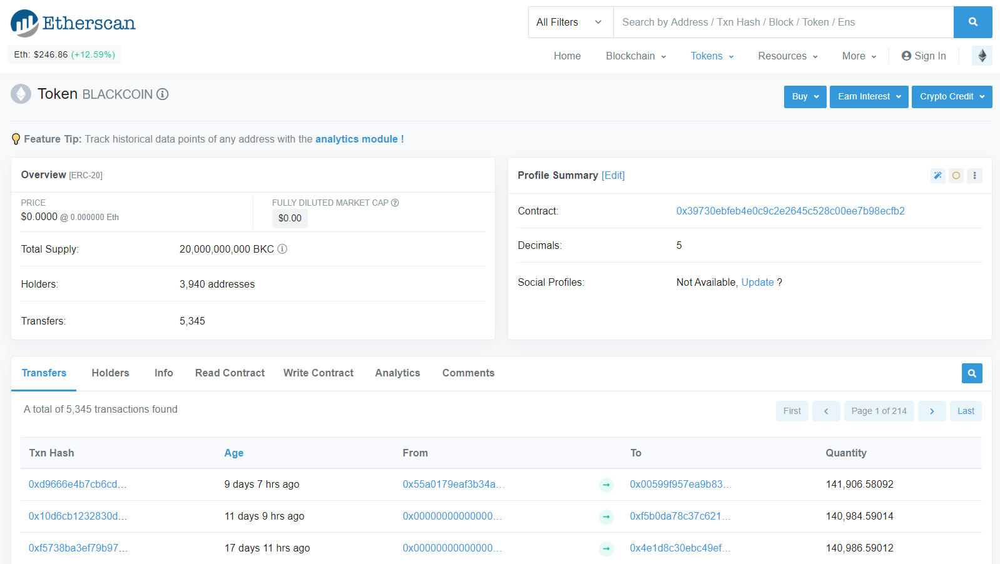
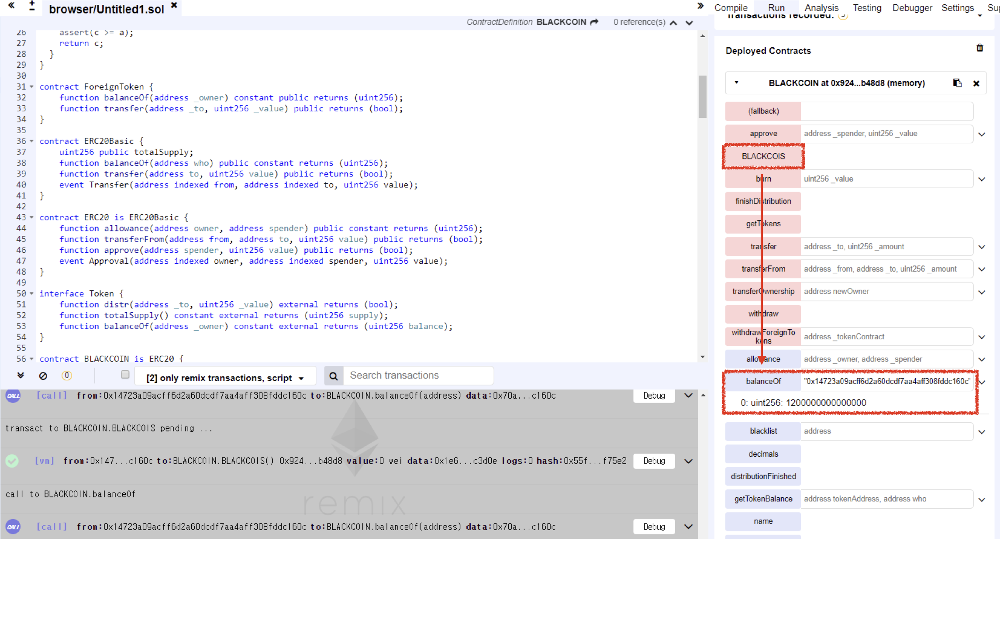

# Vulnerability
CVE-XXX

## Vendor
BLACKCOIN Token

## Vulnerability Type
Typo in Constructor

## Abstract
We found a vulnerability in smart contract of "BLACKCOIN" which is an Ethereum ERC20 Token. Because there is a typo in constructor, the attacker can obtain BLACKCOIN token for free.

## Details
BLACKCOIN is a Ethereum ERC20 Token contract. The total number of transactions submitted to this contract is 5,345, and 3,940 users are holding the BLACKCOIN token.
Moreover, the last transaction date of this contract is 11 days ago which indicates that the contract is actively being used by external users.


  *Figure 1. BLACKCOIN Token Information*

In the constructor of the 'BLACKCOIN' contract, there is a logic of changing owner of the contract to function caller.
Moreover, the BLACKCOIN Tokens are assigned to owner. 

```
contract BLACKCOIN is ERC20 {
...
function BLACKCOIS() public {
   owner = msg.sender;
   balances[owner] = totalDistributed;
    }
}
```
 The constructor of the BLACKCOIN Token becomes normal `public` function due to the typo. The name of the constructor must be `BLACKCOIN` and not `BLACKCOIS`. Because it is a `public` function, external attacker can call this function without any restriction.
By calling this function, attacker can become owner of the contract and could obtain 'BLACKCOIN' Tokens for free and steal ether.
  
```
modifier onlyOwner() {
        require(msg.sender == owner);
        _;
    }

function withdraw() onlyOwner public {
        uint256 etherBalance = address(this).balance;
        owner.transfer(etherBalance);
    }
```
Also, once the attacker becomes the owner of the contract, it can bypass `onlyOwner` modifier and calls `withdraw` function to steal all the ether holds by the contract.

## Exploit

  Below figure is the result of `BLACKCOIS` function. We can obtain Tokens for free and able to become owner of the contract easily.

  
  *Figure 2. The Result of BLACKCOIS() function*

## Conclusion
The constructor name must be same as contract name or `constructor` keyword should be used by developers.

## Reference
https://etherscan.io/token/0x39730ebfeb4e0c9c2e2645c528c00ee7b98ecfb2

## Discoverer
Sungjae Hwang (sjhwang87@kaist.ac.kr) and Sukyoung Rry (sryu.cs@kaist.ac.kr)