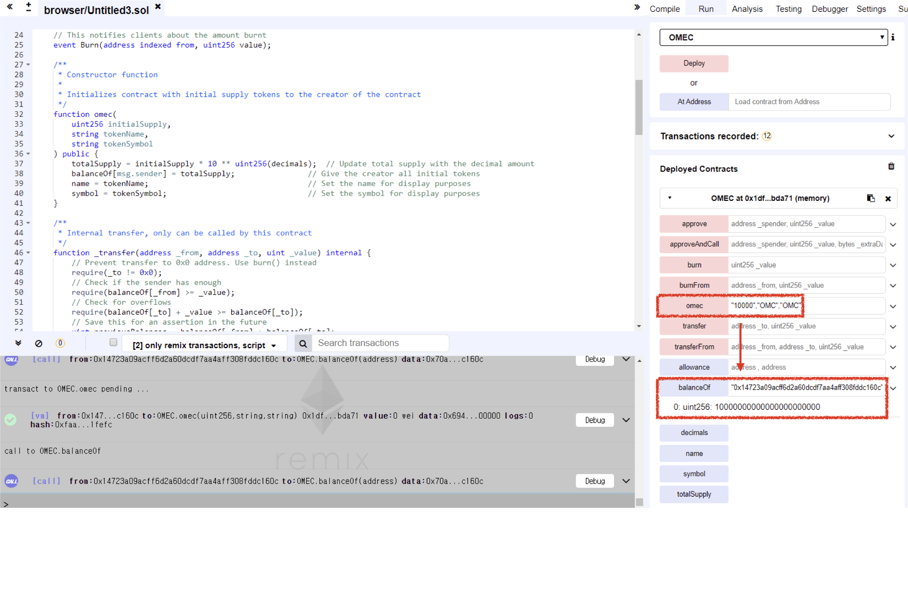

# Vulnerability
CVE-XXX

## Vendor
万能链 Token

## Vulnerability Type
Typo in Constructor

## Abstract
We found a vulnerability in smart contract of "万能链" token. Because there is a typo in constructor, the attacker can obtain 万能链 tokens for free.

## Details
'OMEC' is a Ethereum ERC20 Token contract. The total number of transactions submit to this contract is 4,093, and 372 users holding this token.


  *Figure 1. 万能链 Token Information*

In the constructor of the 'OMEC' contract, all the initial tokens are assigned to constructor caller. 

The problem is that the constructor of the 万能链 token becomes normal `public` function which can be called by external attackers due to the typo in constructor.

By just calling the typo constructor, attacker can obtain tokens for free. 
Note that attacker can control the parameters of the constructor and therefore, he can obtain as many tokens as he wants.

```
contract OMEC {
...
function omec(
    uint256 initialSupply,
    string tokenName,
    string tokenSymbol
) public {
    totalSupply = initialSupply * 10 ** uint256(decimals);  // Update total supply with the decimal amount
    balanceOf[msg.sender] = totalSupply;                // Give the creator all initial tokens
    name = tokenName;                                   // Set the name for display purposes
    symbol = tokenSymbol;                               // Set the symbol for display purposes
}
```


## Exploit

  Below figure is the result of `omec` function. We can obtain Tokens for free easily.

  
  *Figure 2. The Result of omec() function*

## Conclusion
The constructor name must be same as contract name or `constructor` keyword should be used for defining constructor.

## Reference
https://etherscan.io/token/0xdf8ED54d46cd128Bd36EC66d1177f8FeE4e0229a

## Discoverer
Sungjae Hwang (sjhwang87@kaist.ac.kr) and Sukyoung Rry (sryu.cs@kaist.ac.kr)