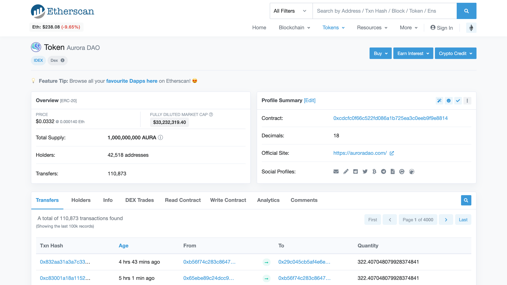
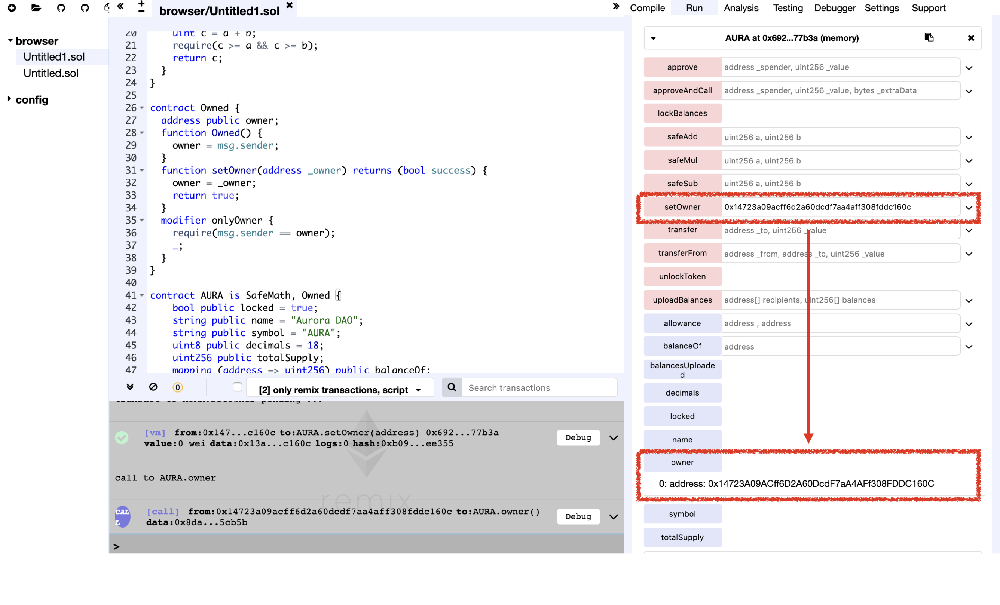

# Vulnerability
CVE-XXX

## Vendor
Aurora DAO (AURA) Token

## Vulnerability Type
Vulnerable Function

## Abstract
We found a vulnerability in smart contract of "Aurora DAO" Token.
Because there is no checking in `setOwner` function, attacker can change owner of token by calling `setOwner` function.

## Details
'Aurora DAO' is an Ethereum ERC20 Token contract. The total number of transfers submit to this contract is 110,873, and 42,518 users holding this token.
Moreover, the last transaction date of this contract is 4 hours ago which is actively used by external users.


  *Figure 1. Aurora DAO Token Information*


```
..
contract Owned {
    address public owner;
    ..
    function setOwner(address _owner) returns (bool success) {
        owner = _owner;
        return true;
    }
    ..
}
..
```

The `setOwner` function in the `Owned` contract updates the `owner` variable which indicates owner of token contract.
The problem is that `setOwner` function is defined as public function, so attacker can change `owner` by calling `setOwner` function.

## Exploit
Below figure shows the result of calling the `setOwner` function.
As we can see that the value of the `owner` variable is successfully changed to `0x14723a09acff6d2a60dcdf7aa4aff308fddc160c` which is the value of the parameter of the `setOwner` function.

  
  *Figure 2. The Result of setOwner function*

## Conclusion
If the function modifies the security-sensitive storage variables, the function callers must be properly authenticated so that only authorized users can update them.

## Reference
https://etherscan.io/token/0xcdcfc0f66c522fd086a1b725ea3c0eeb9f9e8814

## Discoverer
Sungjae Hwang (sjhwang87@kaist.ac.kr) and Sukyoung Rry (sryu.cs@kaist.ac.kr)
