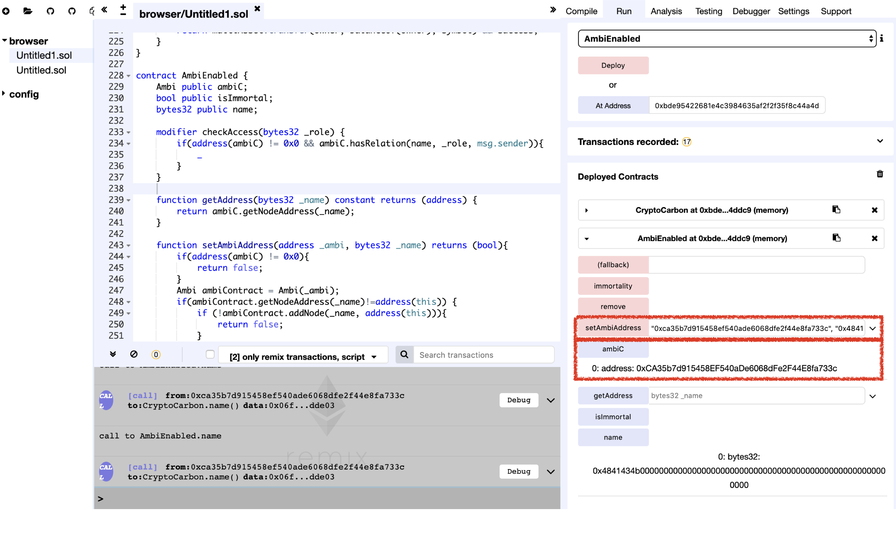

# Vulnerability
CVE-XXX

## Vendor
CCRB Token

## Vulnerability Type
Race Condition Attack

## Abstract
We found a vulnerability in smart contract of "CCRB" Token.
Because the `init` function only check the initialization flag, attacker can pollute token address by calling `init` function before contract owner calls it.

## Details
'CCRB' is an Ethereum ERC20 Token contract. The total number of transfers submit to this contract is 54,303, and 2,899 users holding this token.


  *Figure 1. CCRB Token Information*


```
contract AmbiEnabled {
    Ambi public ambiC;
    bool public isImmortal;
    bytes32 public name;
    ..
    function setAmbiAddress(address _ambi, bytes32 _name) returns (bool){
        if(address(ambiC) != 0x0){
            return false;
        }
        Ambi ambiContract = Ambi(_ambi);
        if(ambiContract.getNodeAddress(_name)!=address(this)) {
            if (!ambiContract.addNode(_name, address(this))){
                return false;
            }
        }
        name = _name;
        ambiC = ambiContract;
        return true;
    }
}
```

The `setAmbiAddress` function in the `AmbiEnabled` contract updates the `ambiC` which holds the address of the token contract.
However, the `setAmbiAddress` function does not authenticate the function caller and only checks the initialize state of the `ambiC` variable. If the `ambiC` is not initialized, the `setAmbiAddress` function updates the `ambiC`.

The problem is that because it does not authenticate the function caller, it leads to a race condition attack.
If the external attacker calls `setAmbiAddress` function before the owner of the contract calls it, he can pollute the address of the token contract and therefore, able to bypass authentication logics and manipulate token information.

## Exploit
Below figure shows the result of calling the `setAmbiAddress` function.
As we can see that the value of the `ambiC` variable is successfully changed to `0xca35b7d915458ef540ade6068dfe2f44e8fa733c` which is the value of the first parameter of the `setAmbiAddress` function.

  
  *Figure 2. The Result of setAmbiAddress function*

## Conclusion
If the function modifies the security-sensitive storage variables, the function callers must be properly authenticated so that only authorized users can update them.

## Reference
https://etherscan.io/token/0xe4c94d45f7aef7018a5d66f44af780ec6023378e


## Discoverer
Sungjae Hwang (sjhwang87@kaist.ac.kr) and Sukyoung Rry (sryu.cs@kaist.ac.kr)
