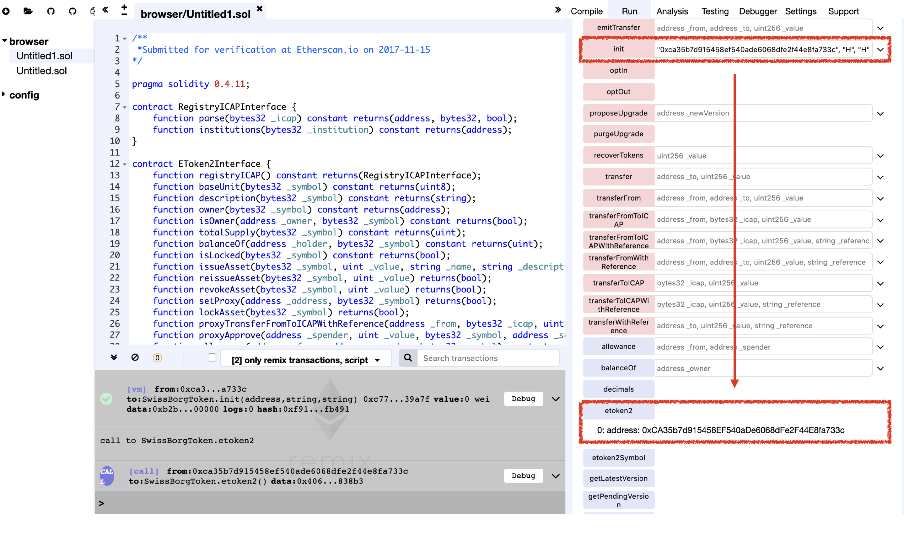

# Vulnerability
CVE-XXX

## Vendor
SwissBorg Token

## Vulnerability Type
Race Condition Attack

## Abstract
We found a vulnerability in smart contract of "SwissBorg" Token.
Because the `init` function only check the initialization flag, attacker can pollute token address by calling `init` function before contract owner calls it.

## Details
'SwissBorg' is an Ethereum ERC20 Token contract. The total number of transfers submit to this contract is 67,300, and 22,247 users holding this token.
Moreover, the last transaction date of this contract is 39 minutes ago which is actively used by external users.


  *Figure 1. SwissBorg Token Information*


```
contract SwissBorgToken is ERC20Interface, AssetProxyInterface, Bytes32 {
    // Assigned EToken2, immutable.
    EToken2Interface public etoken2;

    // Assigned symbol, immutable.
    bytes32 public etoken2Symbol;

    ..
    function init(EToken2Interface _etoken2, string _symbol, string _name) returns(bool) {
        if (address(etoken2) != 0x0) {
            return false;
        }
        etoken2 = _etoken2;
        etoken2Symbol = _bytes32(_symbol);
        name = _name;
        symbol = _symbol;
        return true;
    }
    ..
}
```

The `init` function in the `SwissBorgToken` contract updates the `etoken2` which holds the address of the token contract.
Because the token contract is used for exchange tokens, it is crucial to set the correct address of the token contract.
However, the `init` function does not authenticate the function caller and only checks the initialize state of the `etoken2` variable. If the `etoken2` is not initialized, the `init` function updates the `etoken2`.

The problem is that because it does not authenticate the function caller, it leads to a race condition attack.
If the external attacker calls `init` function before the owner of the contract calls it, he can pollute the address of the token contract and therefore, able to bypass authentication logics and manipulate token information.

## Exploit
Below figure shows the result of calling the `init` function.
As we can see that the value of the `etoken2` variable is successfully changed to `0xca35b7d915458ef540ade6068dfe2f44e8fa733c` which is the value of the first parameter of the `init` function.

  
  *Figure 2. The Result of init function*

## Conclusion
If the function modifies the security-sensitive storage variables, the function callers must be properly authenticated so that only authorized users can update them.

## Reference
https://etherscan.io/token/0xba9d4199fab4f26efe3551d490e3821486f135ba


## Discoverer
Sungjae Hwang (sjhwang87@kaist.ac.kr) and Sukyoung Rry (sryu.cs@kaist.ac.kr)
